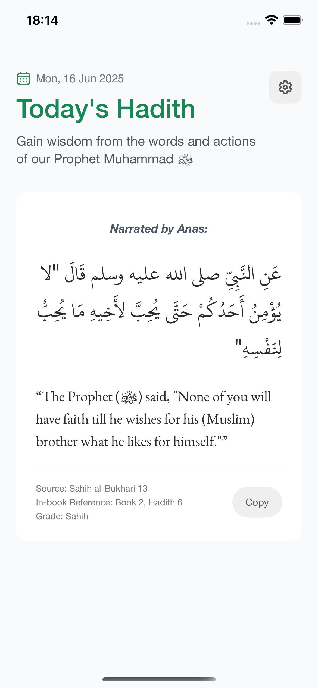
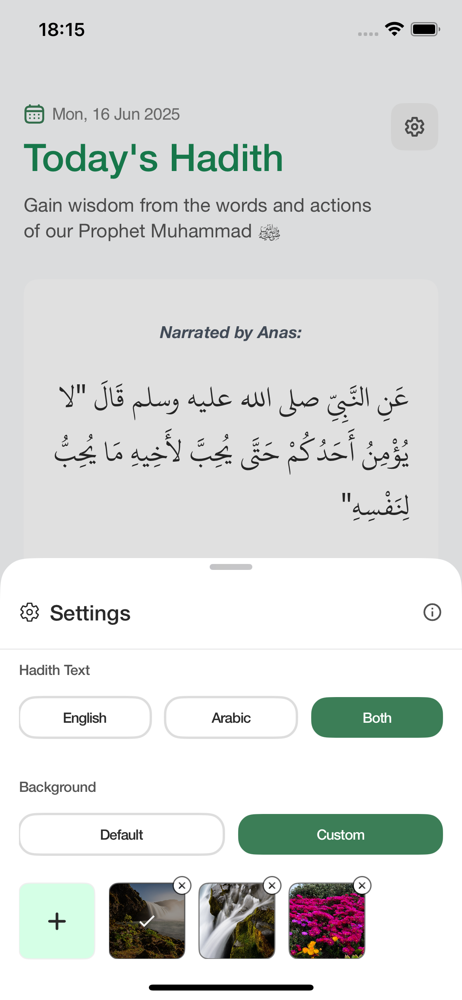
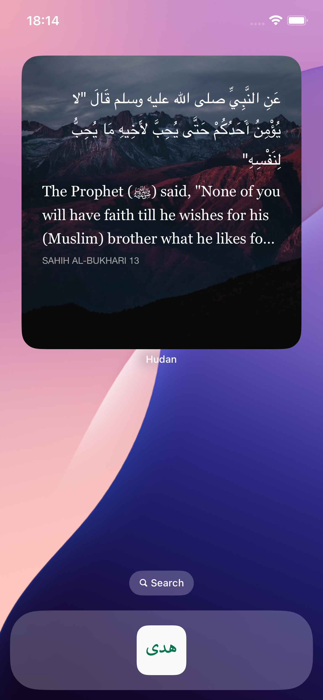

# Hudan

Hudan is a SwiftUI-based iOS app designed to help Muslims stay connected to the teachings of Prophet Muhammad ﷺ through daily Hadith, with a focus on simplicity, ease of use, and spiritual growth.

<div>

[](https://swift.org/)
[](https://developer.apple.com/xcode/swiftui/)
[](https://developer.apple.com/documentation/widgetkit)

<!-- Add other relevant badges here -->

</div>

## App Screenshots

<p align="center">
  
  
  
</p>

## Key Features

#### 📖 Daily Hadith
- Automatically updated every day based on authenticated sources
- Simple, distraction-free reading experience
- Easily share Hadith with friends and family

#### 🌙 Home Screen Widget
- View today's Hadith right from your home screen
- Designed for quick inspiration throughout the day
- Minimal, elegant widget styles to match your setup

#### 🖼️ Custom Backgrounds (Paid Feature)
- Unlock the ability to use your own images as widget backgrounds
- Personalize your spiritual experience
- One-time purchase, no subscriptions

#### ⚙️ User-Friendly Settings
- Choose from default background themes
- Adjust text size and style to your liking
- Seamlessly manage widget appearance and behavior

## Getting Started

### Prerequisites
- Xcode (latest version)
- iOS device or simulator

### Installation

1. Clone the repository:
   ```sh
   git clone https://github.com/yourusername/Hudan.git
   cd Hudan
   ```

2. Open the project in Xcode:
   ```sh
   open Hudan.xcodeproj
   ```

3. Build and run the app:
   - Select a simulator or connected device and click the run button in Xcode.

## Tech Stack

- **Frontend Framework**: SwiftUI
- **Widgets**: WidgetKit
- **Data Source**: Local JSON file for Hadith data

## Contact

For any questions, please contact me at: <a href="mailto:safwan917@gmail.com">safwan917@gmail.com</a>

---
